## Возможности DevTools

Открыть Chrome DevTools можно четырмя способами:

**1.** Одной кнопкой — F12.  
**2.** Сочетанием клавиш — Ctrl + Shift + I в Windows или Command + Option + I в macOS, Ctrl+Alt+I — Linux.  
**3.** Через меню: нажимаем на три точки → «Дополнительные инструменты» → «Инструменты для разработчиков». 

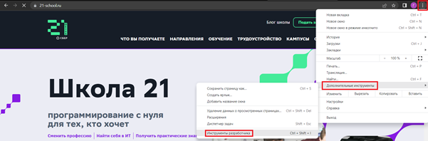

**4.** В контекстном меню: на странице в любом месте кликнуть правой кнопкой мыши и выбрать «Просмотреть код». Главное — не путать с «Просмотр кода страницы», эта опция покажет исходный код вне DevTools.

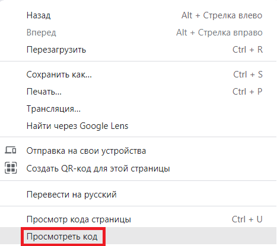

## Инструменты Chrome DevTools

#### Указка, или прицел

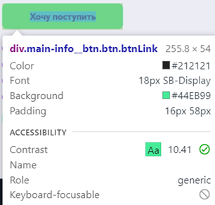

Специальная кнопка в виде стрелки в левом верхнем углу окна DevTools позволяет войти в режим выбора элемента (интересующую кнопку/ссылку/картинку и т.п.), где можно водить курсором по странице в поисках нужного элемента и кликать по нему, чтобы обнаружить кусочек кода в разметке.
Можно воспользоваться горячими клавишами **Ctrl + Shift + С** в Windows или **Cmd + Shift + С** в macOS.
Также элементы подсвечиваются при наведении на них мыши в редакторе.

#### Toggle device toolbar

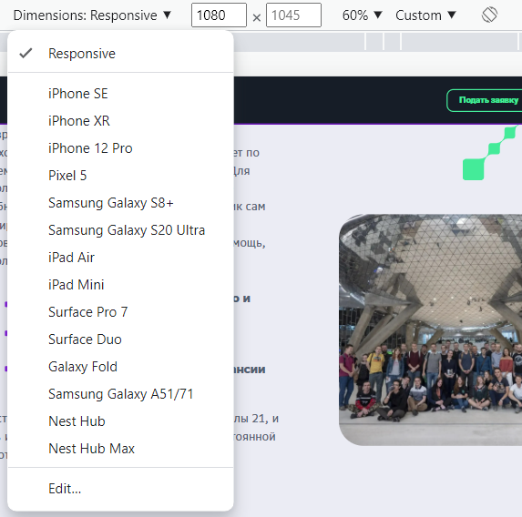

Инструменты Chrome DevTools идеально подходят для тестирования сайта на разных экранах.
Браузер умеет эмулировать любое устройство и любое разрешение экрана. Так что можно, не покидая браузера, взглянуть, как будет выглядеть веб-приложение на планшетах, смартфонах и ПК-мониторах любого размера и с любыми органами управления.

Чтобы перейти в режим адаптивной верстки, надо кликнуть по кнопке Toggle device toolbar или нажать **Ctrl + Shift + M** в Windows или **Cmd + Shift + M** в macOS.

Над сайтом слева появится новая панель управления с кнопкой Dimensions Responsive. Кликнув на нее, появится список доступных устройств. При выборе конкретного девайса, который нужно эмулировать, разметка сайта адаптируется под его разрешение. Либо размер экрана можно ввести вручную.

#### Панель Elements

Используется для выбора и редактирования любых HTML элементов на странице. Позволяет свободно работать c DOM и CSS.

Вкладка необходима при разработке адаптивных интерфейсов, мобильных версий сайтов или для тестирования страниц с разным разрешением монитора.

Информация о стилях в консоли разработчика находится на вкладке **Styles**. В ней можно отключать и редактировать любые CSS-правила, а для некоторых свойств даже предусмотрены помощники. Эту вкладку разработчики используют чаще всего, она помогает проектировать раскладку и внешний вид элементов, а потом переносить все правки в код.
Можно менять значения, деактивировать и дописывать новые правила, менять свойства графических элементов: задавать цвет объекту или градиент, при изменении цвета появляется палитра уже используемых на сайте цветов и пипетка; менять шрифт, его начертание, добавлять отступы. 
Изменения происходят в режиме реального времени. Манипуляции отображаются только в браузере и не видны другим пользователям. Для того чтобы применить исправленное, необходимо поработать с соответствующими файлами на веб-сервере.

Также каждое свойство можно отключить, кликнув по чекбоксу слева от него. С добавлением новых свойств та же ситуация. Они тут отображаются как отдельные единицы интерфейса, а не как часть текстового поля. 

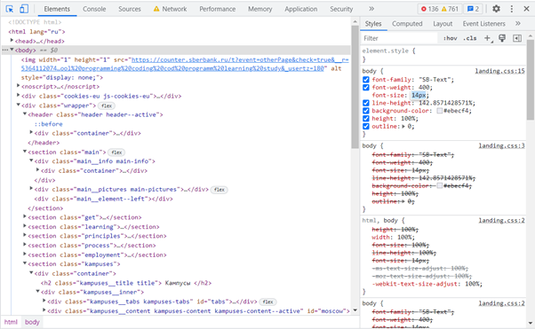

Также для выбранного элемента DOM доступно еще несколько вкладок: ***Event Listeners*** — содержит все события относящиеся к данному элементу, ***DOM Breakpoints*** — точки останова для элемента и ***Properties*** — список всех свойств для элемента. Также могут быть дополнительные вкладки добавляемые расширениями для Chrome.

**Ключевые возможности:**

- Просмотр и редактирование в лайв режиме любого элемента DOM.
- Просмотр и изменение CSS правил применяемых к любому выбранному элементу в панели Styles.
- Просмотр всего списка событий и свойств для элемента на соответствующих вкладках.

#### Панель Console

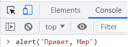

Необходима для логирования диагностической информации в процессе разработки или взаимодействие с JavaScript на странице. Если на открытой странице не подгрузились какие-либо данные, например стили, шрифты или картинки, здесь отобразятся соответствующие ошибки с подробным описанием. Также в консоль можно ввести команду на языке JavaScript, и она выполнится.

Все ошибки в JavaScript коде, будут выводится здесь с указанием файла и конкретного места в нем где произошла ошибка. Так же в консоль можно выводить XHR запросы. Есть возможность сохранять логи в отдельный файл.

Консоль содержит ряд инструментов и настроек для фильтрации выводимых сообщений, очистки консоли и запрета очистки логов при перезагрузке страницы — ***Preserve log***.
Консоль может отобразить/скрыть в виде отдельной вкладки находясь на любой другой вкладке и не покидая ее нажав клавишу Esc.

**Ключевые возможности:**

- Использование консоли как отдельной панели или как окна рядом с любой другой панелью.
- Возможность группировать большое количество сообщения или выведите их на отдельных строках.
- Очистка всех логов или сохранения их между перезагрузкой страниц, сохранение логов в отдельный файл.
- Фильтрация по типу сообщения или по регулярному выражению.
- Логирование XHR запросов.

#### Панель Sources

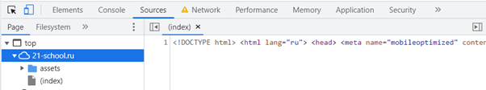

Инструмент **Sources** представляет собой своего рода IDE, где мы можем посмотреть все файлы подключенные на нашей странице. Мы можем посмотреть их содержимое, отредактировать код, скопировать его или сохранить измененный файл, как новый файл. В большей степени она используется при отладке кода, позволяет увидеть все файлы и просмотреть их содержимое. Sources можно использовать в качестве полноценного редактора кода, получив доступ к локальным файлам через Workspaces.

Также Sources используется для отладки JavaScript используя брейкпоинты. Для работы с брейкпоинтами предусмотрено большое количество специальных кнопок и доп. возможностей о которых больше можно узнать в официальной документации.

**Ключевые возможности:**

- Отладка кода с помощью брейкпоинтов.
- Использование браузера в качестве IDE с помощью Workspaces.
- Запуск сниппетов с любой страницы.

#### Панель Network

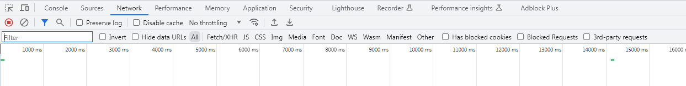

Вкладка Network (Сеть) содержит информацию о HTTP-запросах. Здесь отображаются заголовки, тело запроса, код статуса, тело и время ответа. На этой вкладке тестировщик может увидеть текущий статус сетевых запросов.

URL и тело запроса можно скопировать, чтобы в дальнейшем использовать для тестирования API, например, с применением Postman. Также тут можно обнаружить лишние запросы, отправляемые во время загрузки. Если страница загружается долго, можно определить, с какими запросами это связано.

Для работы со вкладкой Network нажмите на кнопку Record (Запись). Затем отправьте запросы в приложении, и они отобразятся на этой вкладке. Для примера рассмотрим HTTP-запросы, которые зафиксированы на вкладке Network при обновлении страницы <https://edu.21-school.ru/my-profile/about>

Нажмите на HTTP-запрос, чтобы просмотреть:

- URL запроса;
- заголовки запросов и ответов;
- метод запроса и код статуса;
- тело запроса и ответа;  

В нижней части вкладки указаны количество отправленных запросов, объем переданных данных и время загрузки.

Каскадная диаграмма на вкладке позволяет увидеть этапы запросов. Например, сколько времени занял каждый запрос, когда он был отправлен и выполнен. С помощью этого инструмента тестировщик может узнать, какие запросы выполняются параллельно и обнаружить проблемы с производительностью.
  
Над таблицей всех запросов к данным и файлам вкладки "Network" располагаются кнопки для фильтрации нужных Вам запросов, очистки таблицы или включения/отключения записи запросов, кнопки управления отображением таблицы. Также есть дополнительные переключатели:  
- Preserve log — не очищать таблицу при перезагрузке страницы,   
- Disable cache — отключить кэш браузера (будет работать только при открытом Dev Tools),   
- Offline — эмулирует отсутствие интернета, также соседний переключатель позволяющий эмулировать скорость скачивания/загрузки данных и ping для различных типов сетей.

**Ключевые возможности:**  

- Возможность отключить кэширование или установление ограничения пропускной способности.  
- Получение подробной таблицы с информацией о каждом запросе.
- Фильтрация и поиск по всему списку запросов.

#### Панель Performance (Производительность)

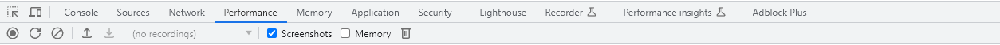

Панель отображает таймлайн использования сети, выполнения JavaScript кода и загрузки памяти. После первоначального построения графиков таймлайн, будут доступны подробные данные о выполнение кода и обо всем жизненном цикле страницы. Появятся возможности ознакомиться со временем исполнения отдельных частей кода, выбрать отдельный промежуток на временной шкале и ознакомиться с тем, какие процессы происходили в этот момент.

Инструмент применяется для улучшение производительности работы Вашей страницы в целом.

**Ключевые возможности:**

- сделать запись чтобы проанализировать каждое событие, которое произошло после загрузки страницы или взаимодействия с пользователем.  
- просмотреть FPS, загрузку CPU и сетевые запросы в области Overview.  
- изменить масштаб таймлайн, чтобы сделать анализ проще.
- сделать серию снимков в процессе загрузки страницы. С ее помощью можно отловить какие-то баги и нелогичное поведение элементов в процессе построения страницы.
- заблокировать определенные запросы

#### Панель Memory (Память)

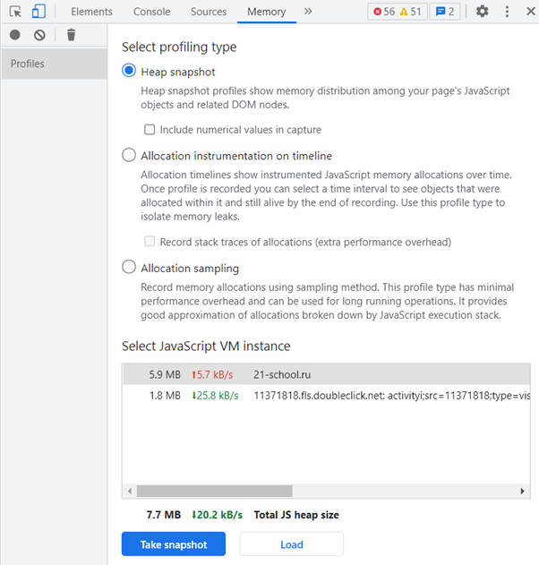

Содержит несколько различных профайлеров для отслеживания нагрузки которую оказывает выполнение кода на систему:

JavaScript CPU Profiler (был вынесен в отдельную панель JavaScript Profiler ) — позволяет узнать сколько процессорного времени занимает выполнение различных частей вашего JS кода.
Take Heap Snapshot — показывает распределение памяти среди JS объектов и связанные с ним элементы DOM.

Record Allocation Timeline — записывает и отображает распределение памяти между переменными в коде. Эффективен для устранения утечек памяти.

Record Allocation Profile — записывает и отображает распределение памяти на выполнение отдельных JS функций.

**Ключевые возможности:**  

- исправление проблем с памятью;
- профилирование CPU при работе с JavaScript.

#### Панель Application (Приложение)

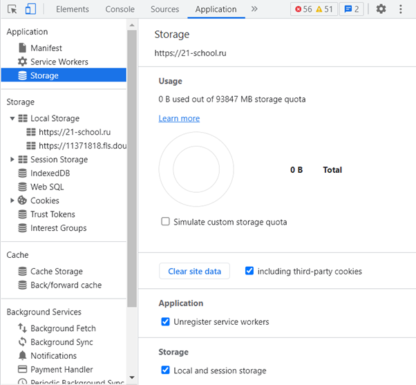

Вкладка для инспектирования и очистки всех загруженных ресурсов, включая IndexedDB или Web SQL базы данных, local и session storage, куков, кэша приложения, изображений, шрифтов и таблиц стилей.

**Ключевые возможности:**

- быстрая очистка хранилищ и кэша;
- инспектирование и управление хранилищами, базами данных и кэшем;
- инспектирование и удаление файлов cookie.

#### Панель Security

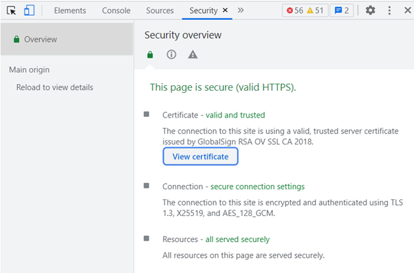

Отвечает за надежность ресурса. Здесь можно получить информацию о данных протокола и сертификата безопасности, если они есть. Также, если источник небезопасный, узнать, какие именно запросы не защищены. Поэтому этот инструмент, как правило, используется для решения проблем со смешанным контентом и другими подобными задачами.

**Ключевые возможности:**

- Окно Security Overview быстро подскажет безопасна ли текущая страница или нет.
- Возможность просмотреть отдельные источники, чтобы просмотреть соединение и детали сертификата (для безопасных источников) или узнать, какие запросы не защищены (для небезопасных источников).

#### Панель Lighthouse 

На этой вкладке можно проверить производительность сайта. А так же даёт конкретные рекомендации: что можно улучшить, чтобы сделать сайт быстрее.

**Какие параметры оценивает Lighthouse**

Lighthouse анализирует четыре показателя: производительность, доступность, SEO и лучшие практики. Для прогрессивных веб-приложений добавляется пятый параметр — PWA.

- Performance — производительность. Анализирует скорость загрузки сайта. На эту оценку влияет время блокировки, отрисовки стилей, загрузки интерактивных элементов, шрифтов и контента.

- Progressive Web App — Прогрессивные web-приложения. Проверяет, регистрирует ли сайт Service Workers, работает ли офлайн, возвращает ошибку 200.

- Best Practices — лучшие практики. Проверяет безопасность сайта и использование современных стандартов веб-разработки. Оценка зависит от того, используется ли на сайте HTTPS, устаревшие API, правильная кодировка и другие параметры.

- Accessibility — доступность. Проверяет, могут ли все пользователи получать доступ к контенту и эффективно перемещаться по сайту. Эта оценка зависит от понятности и воспринимаемости контента, возможности управлять интерфейсом и передвигаться по содержимому без помощи мыши.

- SEO — оценивает соответствие страницы советам Google по поисковой оптимизации. Здесь проверяется использование метатегов, доступ к индексации и переобходу роботами, наличие атрибутов alt у изображений, адаптированность к мобильным экранам и другие характеристики.

Каждый параметр оценивается по 100-балльной шкале: чем выше, тем лучше. У каждой группы оценок также есть свой цвет. Зелёный выставляется при 90-100 баллах, он показывает, что с сайтом всё хорошо. Оранжевый можно получить при 50-89 баллах. То есть с сайтом всё хорошо, но можно сделать ещё лучше. Если оценка ниже 49 баллов, она становится красной. Это означает, что над производительностью стоит поработать.

Большой плюс Lighthouse в том, что проверять качество сайта можно как на десктопной, так и на мобильной версии.

#### Панель Recorder

В инструментах разработчика DevTools появилась новая панель – «Recorder». С её помощью можно записать, воспроизвести и измерить, как быстро реагирует сайт на действия пользователя. Например, в процессе оформления заказа.

Панель Recorder поможет измерить метрику «Отзывчивость». 
Метрика «Отзывчивость» отражает общую отзывчивость страницы, то есть скорость реакции на все события, а не только на первое взаимодействие. 

Панель доступна для версии Chrome Canary. Пока в рамках теста.

**Зачем нужна:**
- записать весь пользовательский путь, а не только первое взаимодействие. Можно записать как пользователь добавил товар в корзину, перешёл в корзину, начал оформлять заказ, заполнил платёжные реквизиты и т.д.;
- воспроизвести пользовательский путь. При воспроизведении также можно имитировать медленное интернет-соединение. Для этого в настройках в раскрывающемся списке выберите «медленный 3G»;
- измерить производительность. Если кликнуть на кнопку «Measure Performance», то сначала вы увидите воспроизведение пути пользователя, а потом разбивку на секунды на панели «Performance». На этой панели можно установить флажок Web Vitals и определять, как улучшить скорость ответа страницы

#### Performance Insights

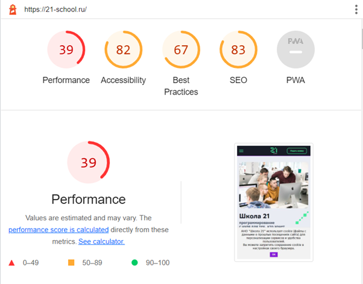

Вкладка Performance Insights в Chrome DevTools позволяет пользователям измерять загрузку страницы веб-сайта. Для этого проводится анализ производительности сайта и предоставляются показатели различных аспектов процесса загрузки страницы, таких как время, необходимое для отображения страницы, время загрузки сетевых ресурсов и время, необходимое для интерактивности страницы.

Анализ производительности выполняется путем имитации посещения сайта пользователем и взаимодействия с ним, что позволяет инструменту точно измерить производительность страницы в реальных условиях. Эта информация может быть использована для определения областей сайта, которые могут вызывать замедление работы, и для оптимизации производительности страницы.

Выполните следующие шаги, чтобы запустить анализ:

1. Откройте Chrome Devtools
2. Выберите вкладку "Performance insights"
3. Нажмите на кнопку "Measure page load"

Анализ предоставляет нам подробное представление водопада запросов с цветовой кодировкой по типам запросов. Это может помочь определить запросы, которые блокируют/замедляют рендеринг страницы, и/или дорогие вызовы функций, которые блокируют основной поток. Он также предоставляет информацию о важных показателях производительности, таких как DCL (DOM Content Loaded), FCP (First Contentful Paint), LCP (Largest Contentful Paint) и TTI (Time To Interactive). Также возможно имитировать дросселирование сети или процессора, или включить кэш, если это потребуется.

- DCL - это время, необходимое для разбора исходного HTML-документа и построения DOM. 
- FCP - это время, необходимое для отображения на странице первого содержательного элемента, например, изображения или текста. 
- LCP - это метрика, измеряющая скорость загрузки самого большого элемента на веб-странице, например, изображения или блока текста. Быстрый LCP помогает пользователям как можно быстрее увидеть основное содержимое страницы, что может улучшить общее впечатление пользователя. 
- TTI - это время, необходимое для того, чтобы страница стала полностью интерактивной, то есть все необходимые ресурсы были загружены, и страница реагирует на действия пользователя.

### Возможности DevTools

**Искать и исправлять баги**
- Ситуация: вы сделали свой сайт, а он работает как-то несуразно — картинки не грузятся, кнопки не нажимаются, слайдеры уехали в подвал, а вместо красивых шрифтов стандартный Times New Roman. Как быть?
Можно перелопатить весь код проекта и найти ошибки вручную. Но если сайт большой и сложный, на это уйдёт много часов.

- Решение: переходим во вкладку **Console** браузера. Там смотрим, в какой строке кода закралась ошибка, что она означает, и исправляем баг на лету.

**Редактировать исходный код**
Вся внешняя сторона интернета пишется на трёх языках: HTML, CSS и JavaScript. Если знать их на базовом уровне, можно переделать любой сайт как нравится: перекрасить фон, поменять шрифты, добавить обводку картинкам. Вот как это сделать с помощью DevTools:

- Наводим курсор на элемент, который хотим изменить.
- Кликаем правой кнопкой и выбираем «Посмотреть код» — откроется вкладка **Elements**.
- Браузер подсвечивает элемент и показывает, какой код за него отвечает.
А дальше дело за нами — где-то цвета докрутить, где-то обводку поменять. В общем, всё, что придумаете.
Например, мы поменять цветовую гамму веб-приложения с холодной на тёплую — лето же. :)

**Верстать страницы без кода**
Если активировать «режим дизайна», можно редактировать сайты в Chrome без кода — как обычный текст. Вот зачем это может пригодиться:

- Для работы — например, чтобы проверить, не «расползётся» ли макет, если загрузить туда новый контент. Это важная задача для веб-дизайнера.
Для развлечения — например, чтобы разыграть друзей или исправить оценки в электронном дневнике. 🤫
Чтобы перейти в дизайн-код, откройте вкладку Console в инструментах разработчика и запустите вот такую команду:
document.designMode = 'on'
Теперь можно закрывать консоль и делать всё, что душа просит.
Единственный момент — все изменения видны только вам и сбросятся сразу после перезагрузки страницы. Так что прокачать сайт навсегда не получится. А жаль.

**Проектировать мобильные сайты**
Важная часть работы фронтендера — сделать так, чтобы сайт было удобно читать на мобильных устройствах. Для этого в DevTools есть режим смартфона — он имитирует работу разных девайсов и помогает адаптировать контент под небольшие экраны.

Вот что можно настраивать с его помощью:
- Визуальную часть — проследить, чтобы сайт правильно отображался на смартфоне: текст не уезжал за границы, элементы нормально группировались, а кнопки не заслоняли контент.
- Железо — посмотреть, как сайт работает с аппаратной частью смартфона: процессором, связью, GPS или сканером отпечатков.
Допустим, нам надо посмотреть, как выглядит сайт на iPhone 12 Pro. Чтобы это сделать, открываем инструменты разработчика и нажимаем на кнопку слева от вкладки Elements.
Откроется окно просмотра, которое можно растягивать и подстраивать под размер любого устройства

**Разобраться со скоростью**
Чтобы сайты быстро открывались и не тормозили, их нужно периодически оптимизировать — работать с памятью, сетевыми запросами и нагрузкой на железо. Вот три вкладки в DevTools, которые могут с этим помочь:

**Сеть** — посмотреть, сколько времени занимает загрузка сайта.
**Производительность** — узнать, как сайт ведёт себя после загрузки и как влияет на процессор пользователя.
**Память** — понять, какие части кода подъедают оперативку и как с этим бороться.
Если не хотите с этим возиться, можно запросить автоматический отчёт о состоянии сайта во вкладке **Lighthouse**. Браузер сам расскажет, какие у сайта есть проблемы по части железа и как их решить. А ещё даст советы по вёрстке, контенту и поисковой оптимизации.

**Запускать скрипты**
Писать код можно не только в специальных программах — обычный браузер тоже подходит. Для этого там есть интерпретатор, который умеет исполнять команды на JavaScript. Таким способом можно запускать любой код на любом сайте, даже если у вас нет к нему доступа.

Вот как это сделать:
- Берём код на JavaScript.
- Вставляем в консоль браузера. Браузер проверяет его на ошибки, а потом выполняет построчно.
Происходит магия.
